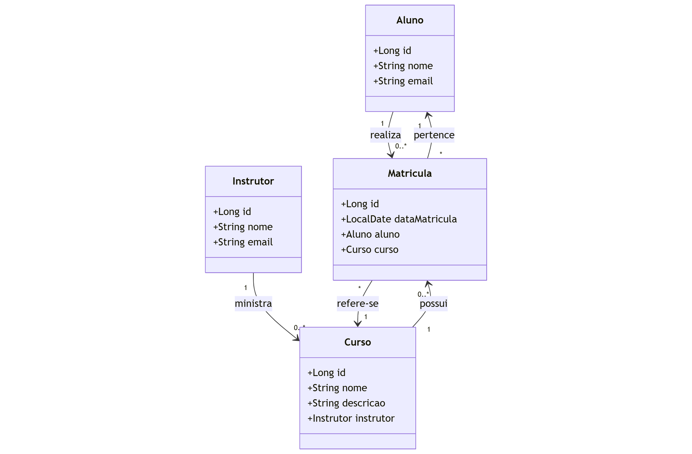

# 🧑‍🏫 Curso Online API

API RESTful desenvolvida com Java e Spring Boot para gerenciamento de cursos online, incluindo operações de CRUD para entidades como Aluno, Instrutor e Matrícula, além de um sistema de tratamento global de erros.

---

## 🚀 Tecnologias Utilizadas

- Java 21
- Spring Boot
- Spring Data JPA
- H2 Database (para testes)
- Maven
- Postman (para testes dos endpoints)

---

## 📦 Funcionalidades

- Cadastro, listagem, atualização e remoção de Alunos e Instrutores
- Cadastro de Matrículas (vinculando Alunos a Instrutores)
- Uso de DTOs para requisições e respostas
- Tratamento global de exceções com mensagens padronizadas
- Validações com mensagens de erro amigáveis

---

## 📝 Diagrama Básico


## ❗ Tratamento de Erros

A API utiliza um `@ControllerAdvice` com tratamento padronizado para:

- `ResourceNotFoundException` → Recurso não encontrado
- `DatabaseException` → Erros relacionados à base de dados
- `MethodArgumentNotValidException` → Erros de validação (Bean Validation)

Exemplo de retorno de erro:
```json
{
  "timestamp": "2025-04-15T13:00:00Z",
  "status": 404,
  "error": "Resource not found",
  "message": "Aluno com ID 10 não encontrado.",
  "path": "/alunos/10"
}
```

## 📫 Contato
📌 Veja mais no meu perfil do [LinkedIn](https://www.linkedin.com/in/victor-almada)

Apaixonado por tecnologia e sempre em busca de novos aprendizados 🚀
